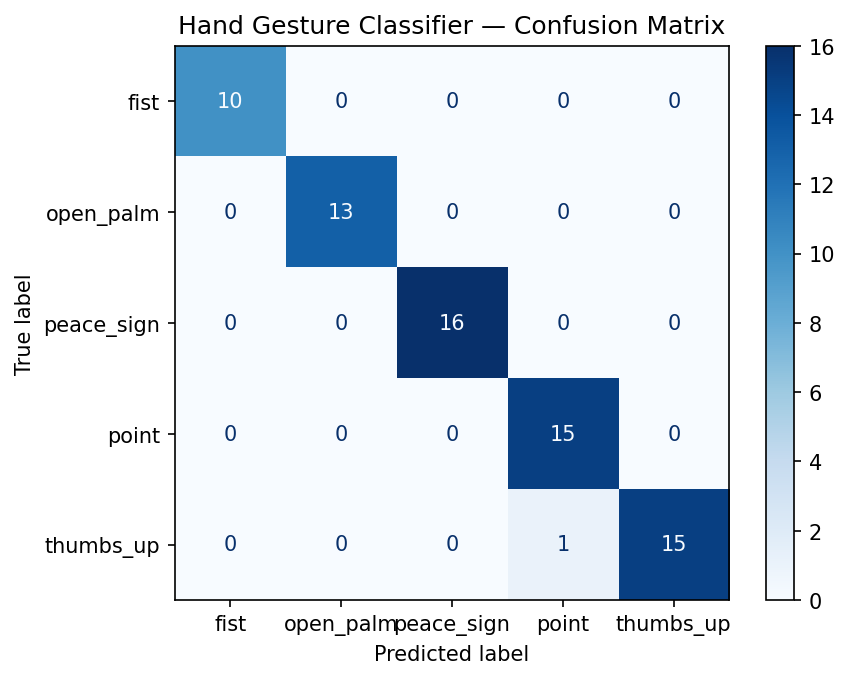

# Real-Time Hand Gesture Recognition

A live webcam-based gesture classifier using MediaPipe hand landmark
detection and a Random Forest classifier — recognizes hand gestures
(fist, open palm, thumbs up, peace sign, point) in real time.

## Demo


## How it works

1. **MediaPipe** detects 21 hand landmark points (fingertips, knuckles,
   wrist) from each webcam frame, giving 63 numbers (x, y, z per point)
   that describe the hand's exact pose.
2. A **Random Forest classifier** is trained on these landmark
   coordinates to recognize which gesture they represent — deliberately
   a small, classical model rather than a deep neural network, since
   the dataset (a few hundred hand-collected samples) doesn't call for
   anything heavier.
3. Live inference runs this classifier frame-by-frame on webcam video,
   overlaying the predicted gesture and confidence directly on screen.

## Setup

```bash
pip install opencv-python mediapipe scikit-learn pandas joblib
```

## Usage

Run these in order, from inside `src/`:

**1. Collect training data:**
```bash
python collect_data.py
```
Hold each gesture in front of your webcam and press its number key to
record a sample. Aim for 50-100+ samples per gesture, varying hand
angle/distance slightly between samples.

**2. Train the classifier:**
```bash
python train_classifier.py
```
Prints test accuracy and a full classification report.

**3. Run live recognition:**
```bash
python live_inference.py
```
Shows your webcam feed with the predicted gesture and confidence
overlaid in real time. Press 'q' to quit.

## Results

*(Fill in after training: test accuracy from train_classifier.py's
output, plus the generated confusion matrix image below.)*



## Summary

This project implements real-time hand gesture recognition using
MediaPipe for hand landmark detection and a Random Forest classifier
trained on the resulting landmark coordinates. Rather than classifying
raw video frames directly, each frame is reduced to 21 hand landmark
points (63 numbers: x, y, z per point), which are then classified —
a lightweight, fast approach well suited to the small, self-collected
training dataset.

The classifier is trained on manually recorded samples across five
gesture classes (fist, open palm, thumbs up, peace sign, point),
evaluated with a held-out test split, and assessed using accuracy and
a full confusion matrix. Live inference runs the same pipeline in
real time on webcam video, overlaying the predicted gesture and
confidence score directly on screen.

A Random Forest was deliberately chosen over a deep neural network:
with only a few hundred hand-collected samples and 63 input features,
a small classical model is appropriately sized for the available data,
avoiding the risk of training an oversized model on too little data.

## Future work

- Add more gesture classes
- Two-hand gesture support
- Map gestures to real actions (e.g. media control, presentation
  navigation) as a follow-up project
